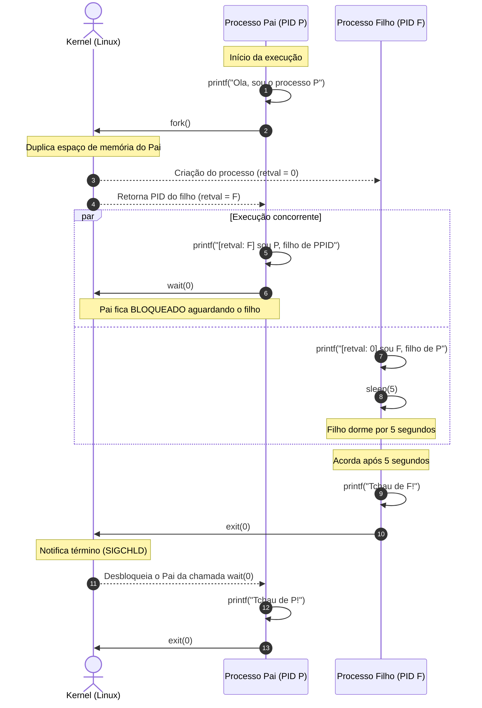

```mermaid
sequenceDiagram
    autonumber
    actor Kernel as Kernel (Linux)
    participant Pai as Processo Pai (PID P)
    participant Filho as Processo Filho (PID F)

    Note over Pai: Início da execução
    Pai->>Pai: printf("Ola, sou o processo P")
    Pai->>Kernel: fork()
    Note over Kernel: Duplica espaço de memória do Pai
    Kernel-->>Filho: Criação do processo (retval = 0)
    Kernel-->>Pai: Retorna PID do filho (retval = F)

    par Execução concorrente
        Pai->>Pai: printf("[retval: F] sou P, filho de PPID")
        Pai->>Kernel: wait(0)
        Note over Pai,Kernel: Pai fica BLOQUEADO aguardando o filho
    and
        Filho->>Filho: printf("[retval: 0] sou F, filho de P")
        Filho->>Filho: sleep(5)
        Note over Filho: Filho dorme por 5 segundos
    end

    Note over Filho: Acorda após 5 segundos
    Filho->>Filho: printf("Tchau de F!")
    Filho->>Kernel: exit(0)
    Note over Kernel: Notifica término (SIGCHLD)
    Kernel-->>Pai: Desbloqueia o Pai da chamada wait(0)

    Pai->>Pai: printf("Tchau de P!")
    Pai->>Kernel: exit(0)
```
